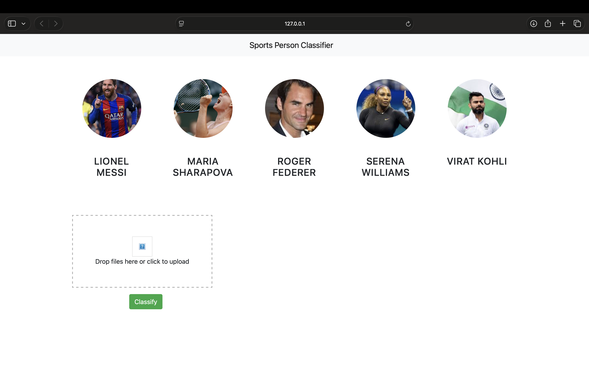

# Celebrity Image Classification using OpenCV & Wavelet Transform

## 📌 Project Overview

This project builds a **Machine Learning based Image Classification system** that identifies celebrities from images.
The system uses **OpenCV for face and eye detection**, **Wavelet Transform for feature extraction**, and **Machine Learning models** for classification.

The pipeline ensures that only **clear face images (with two visible eyes)** are used for training, improving model accuracy.

---

# 🚀 Project Pipeline

The overall workflow of the project is:

Dataset → Face Detection → Face Cropping → Wavelet Transform → Feature Extraction → Model Training → Prediction

---

# 📂 Dataset Structure

The dataset should be organized into folders where each folder represents a **celebrity class**.

```
dataset/
    lionel_messi/
        img1.jpg
        img2.jpg
    cristiano_ronaldo/
        img1.jpg
        img2.jpg
    virat_kohli/
        img1.jpg
        img2.jpg
```

Each folder name becomes the **label for classification**.

---

# ⚙️ Technologies Used

* Python
* OpenCV
* NumPy
* PyWavelets
* Scikit-learn
* Matplotlib
* Jupyter Notebook

---

# 🧠 Key Concepts Used

### 1️⃣ Face Detection

OpenCV Haar Cascade classifiers are used to detect faces and eyes.

The system only accepts images where **two eyes are detected** to ensure the face is clear.

---

### 2️⃣ Face Cropping

Detected faces are cropped and saved into a new folder for further processing.

Example output:

```
dataset/cropped/
    messi/
        messi1.png
        messi2.png
    ronaldo/
        ronaldo1.png
```

---

### 3️⃣ Wavelet Transform (Feature Extraction)

Wavelet Transform extracts **high-frequency features such as edges and textures** from the image.

This helps the model focus on **important facial features**.

Function used:

```
def w2d(img, mode='haar', level=1):
```

Steps:

1. Convert image to grayscale
2. Normalize pixel values
3. Apply wavelet decomposition
4. Remove low-frequency components
5. Reconstruct the image

---

### 4️⃣ Feature Vector Creation

Two images are combined:

* Raw image
* Wavelet transformed image

Both are flattened and combined into a **single feature vector** used for model training.

---

# 🏗️ Model Training

Machine Learning models used:

* Support Vector Machine (SVM)
* Logistic Regression
* Random Forest

GridSearchCV is used to find the **best performing model and hyperparameters**.

---

# 📊 Model Evaluation

The model performance is evaluated using:

* Confusion Matrix
* Accuracy Score
* Classification Report

---

# ▶️ How to Run the Project

### 1️⃣ Install Dependencies

```
pip install opencv-python
pip install numpy
pip install pywavelets
pip install scikit-learn
pip install matplotlib
```

---

### 2️⃣ Run Jupyter Notebook

```
jupyter notebook
```

Open the notebook and run all cells step by step.

---

# 📸 Example Prediction

Input Image → Face Detection → Feature Extraction → Model Prediction

Example Output:

```
Prediction: Lionel Messi
Confidence: 92%
```

---

# 📌 Key Learning Outcomes

From this project you will learn:

* Image preprocessing
* Face detection using OpenCV
* Feature extraction using Wavelet Transform
* Machine learning model training
* Building an end-to-end image classification pipeline

---

# 👩‍💻 Author

Developed as part of a **Machine Learning / Computer Vision learning project**.

---
## Face Detection Example


